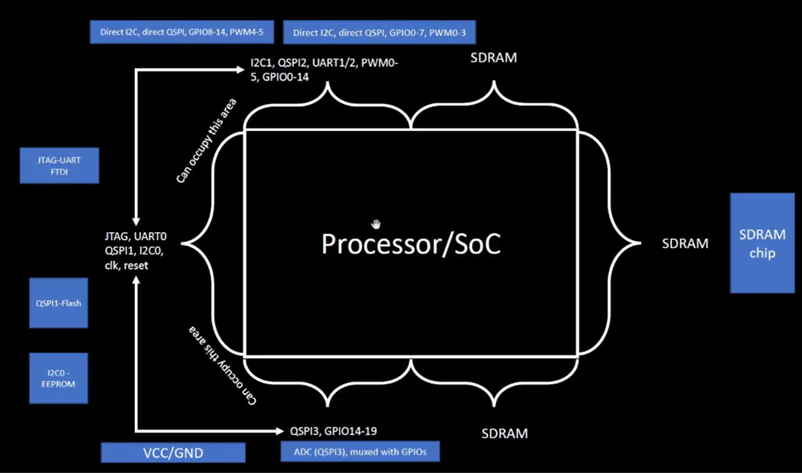
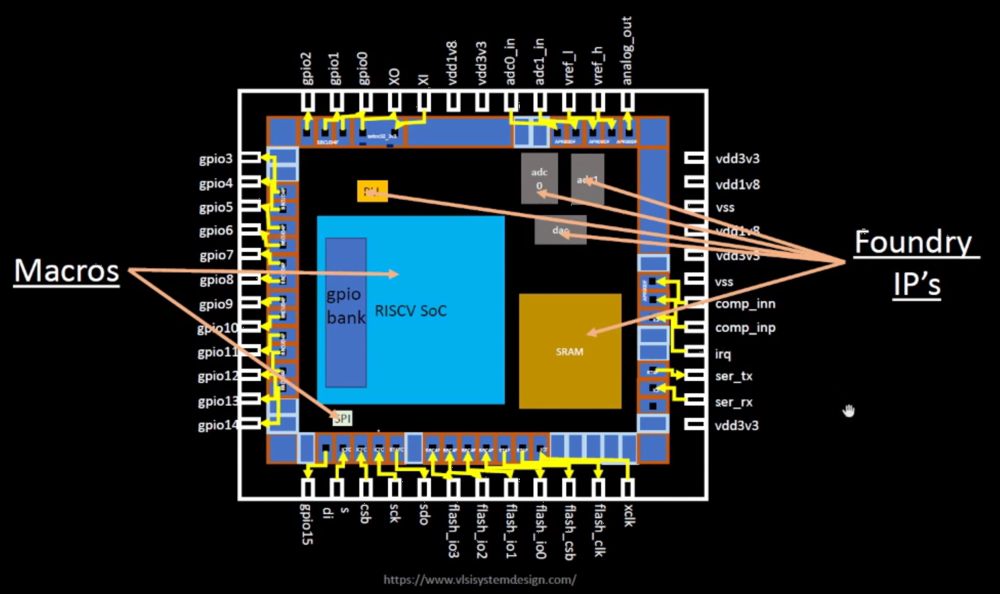

# Advanced_Physical_Design_using_OpenLANE-Sky130_Workshop
Workshop on Advanced_Physical_Design_using_OpenLANE-Sky130

Place and route in complex VLSI design involves placing the cells and connecting them to meet the design power, performance, and area (PPA) goals.
This workshop contains SoC design planning in Openlane flow using the latest Google-SkyWater 130nm process node.

Aim of this workshop:
* Design and characterize your own standard cell.
* Have a hands-on in the Physical Design domain.
* Generate a full GDSII from a RTL netlist.
* Explore and contribute to open source EDA world.

# Agenda of the workshop

Day 1 - Inception of open-source EDA, OpenLANE and Sky130 PDK:
* [How to talk to computers](#how-to-talk-to-computers)
* SoC design and OpenLANE
* Starting RISC-V SoC Reference design
* Get familiar to open-source EDA tools

Day1:

# How to talk to computers

All FPGA Boards contains chip inside which plays a major role in funcitoning of the board. The functionalitites of the the SoC/Processor is shown below.

Inside the processor core, the macros, foundry IP's and GPIO pins are arranged in a structured manner as shown in the below diagram.

